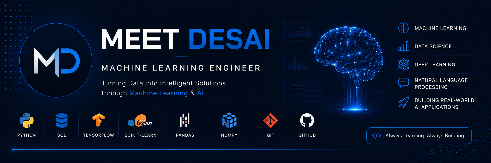

  

<h1 align="center">Hi 👋, I'm Meet Desai</h1>

<h3 align="center">Machine Learning • Data Science • Python</h3>

---

## 👨‍💻 About Me

🎓 **B.Tech Information Technology** student

🤖 Focused on **Machine Learning**, **Data Science**, and **Artificial Intelligence**

💡 Building **end-to-end Machine Learning applications** using real-world datasets

🐍 Working with **Python**, **SQL**, **Scikit-learn**, **TensorFlow/Keras**, **Pandas**, and **NumPy**

🚀 Goal: Build intelligent AI systems that solve real-world problems

---

# 🚀 Currently Exploring

🧠 Deep Learning • 💬 Natural Language Processing • 🤖 Large Language Models (LLMs) • ⚙️ MLOps

---

## 📊 GitHub Analytics

<table>
<tr>
  <td width="35%">

</td>
<td width="65%">

</td>
</tr>
</table>
